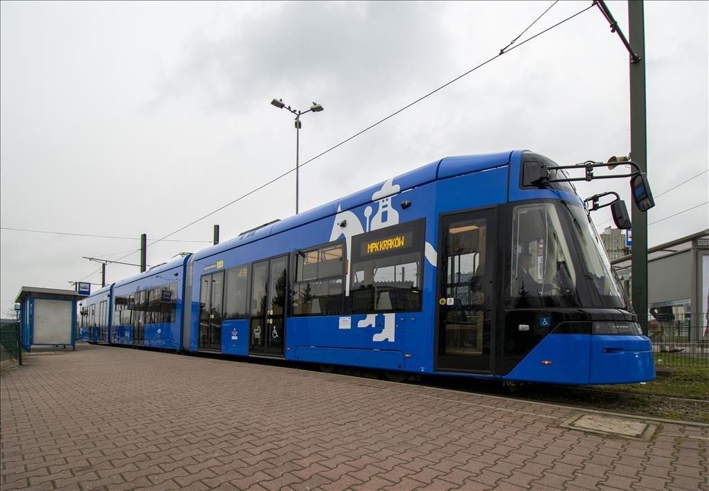
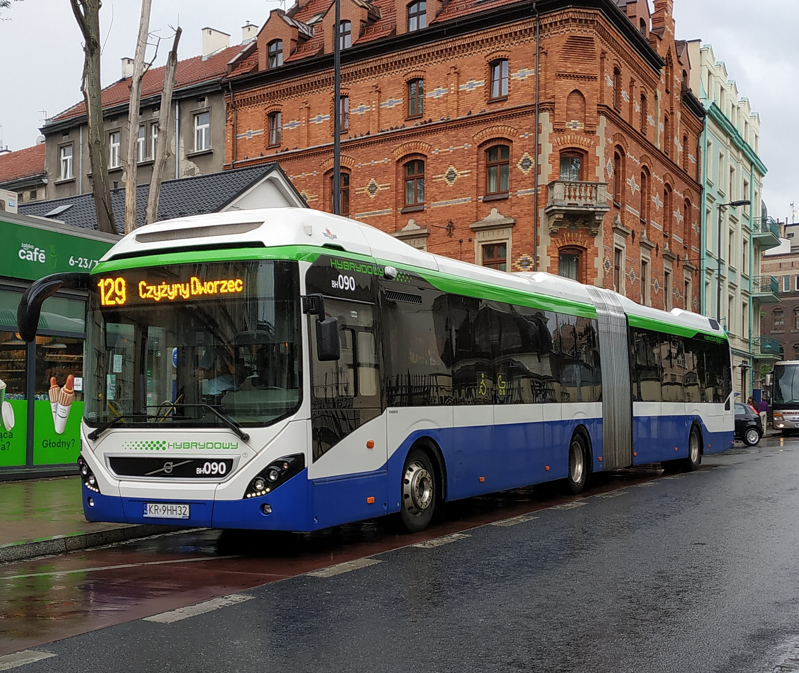

# Public Transport in Krakow
## INTRODUCTION
This project is about public transport in Krakow, that README file will describe things like - Comfort,Price,Speed,Size and Frequency of the most popular ways to get around the city with a public transport. We will use some images in order for the reader to visualize the state in what transport such as - Busses both electro and diesel, Trams and trains.  
Public transport in general is the easiest and fastest way to reach your destination when you are visiting new city. For example you are a tourist with limited budget and want to get the most out of your trip, why would you spend your hard earned money on renting a car or taxi if you will stay in e.g. Krakow for couple of days.  
City like krakow can be very handy when it comes to navigating around the city, with online schedule of each bus and tram which usually correct, even if there is a delay in one specific bus, it will show it online.There is even an app for easy navigation called JakDojade, just write deportation adress and your destination and you are good to go, it will navigate you to the nearest bus/tram stop and tell you exactly when you need to get off.
## DATA
Table below will show some more info that you mind need during usage of Krakows public transport.
Something like - Comfort,Price,Speed,Size and Frequency.
All prices listed in Polish currency called zloty(ZL).Sign + at the end of some values mean - that value and more.
| Info | Buss | Tram | Electro Buss | Train |
|------| -----|------|--------------|-------|
| Price per ticket | 2 | 3 | 2 | 20+ |
| Avarage speed | 20km/h | 15km/h | 17km/h | 50km/h+ |
| Comfort | Avarage | Below Avarage | Avarage | High |
## IMAGES
Here you can see some of the pictures of public transport taken in krakow
### Tram

### Bus

